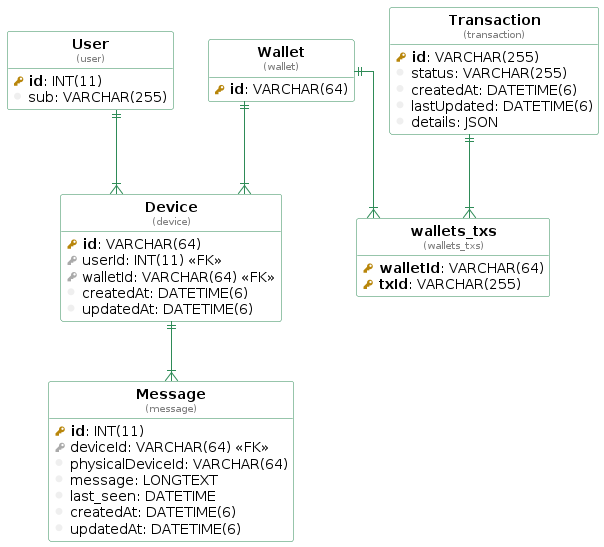

#  Non-Custodial Wallet Demo backend

## Description

This is a demo application showcasing the capabilities of the Fireblocks platform with regard to Non Custodial Wallets.

## Structure

### modules tree

- `src` - the main module of the project
  - `model` - DB model entities
  - `migrations` - DB migrations
  - `subscribers` - DB subscribers
  - `controllers` - Express request handlers
  - `middleware` - Express middleware
  - `routes` - Express route mapping
  - `interfaces` - Type interfaces
  - `services` - Business logic
  - `test` - test related
  - `util` - utlities

## Usage

### Configurations

The following environment variables are required,

- General
  - `PORT` - API listen port
- Fireblocks
  - PEMs - Please replace newlines with "\n" when providing PEMs.
    - `FIREBLOCKS_WEBHOOK_PUBLIC_KEY` - Fireblocks webhook public key PEM (note: sandbox and production have different keys, [docs](https://developers.fireblocks.com/docs/webhooks-notifications#validation))
    - `FIREBLOCKS_API_SECRET` - Private key PEM used for API Users (in production it's recommended to use different keys)
  - API
    - `FIREBLOCKS_API_KEY_NCW_SIGNER` - uuid key for API User: NCW Signer Role
    - `FIREBLOCKS_API_KEY_NCW_ADMIN` - uuid key for API User: NCW Admin Role
    - `FIREBLOCKS_API_BASE_URL` - Depending on your workspace environment: `https://sandbox-api.fireblocks.io/` or `https://api.fireblocks.io/`
- Authentication - JWT verification middleware ([NPM express-oauth2-jwt-bearer](https://www.npmjs.com/package/express-oauth2-jwt-bearer))
  - `ISSUER_BASE_URL`=`https://YOUR_ISSUER_DOMAIN`
  - `AUDIENCE`=`https://my-api.com`
  - `JWKS_URI` - optional
  - `ISSUER` - optional
- Database (mysql)
  - `DB_HOST` - Database host
  - `DB_PORT` - Database port
  - `DB_USERNAME` - Database username
  - `DB_PASSWORD` - Database password
  - `DB_NAME` - Database name
- CoinMarketCap
  - `CMC_PRO_API_KEY` - CoinMarketCap API Key (optional for asset quotes)

### Install

```bash
$ yarn
```

### Test

```bash
$ yarn test
```

### Build

```bash
$ yarn build
```

### Start

```bash
$ yarn start
```

### Migration

Create

```bash
yarn typeorm migration:create -n NameOfMigration
```

OR auto generate

```bash
yarn typeorm migration:generate src/migrations/NameOfMigration
```

Run

```bash
yarn migrate
```

### Model



auto-generated via `yarn db:diagram`

## Links

TBD
