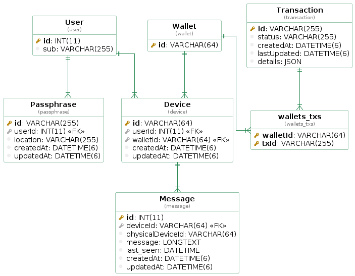

#  Non-Custodial Wallet Demo backend

## Description

This is a demo application showcasing the capabilities of the Fireblocks platform with regard to Non Custodial Wallets.

## Structure

### modules tree

- `src` - the main module of the project
  - `model` - DB model entities
  - `migrations` - DB migrations
  - `subscribers` - DB subscribers
  - `controllers` - Express request handlers
  - `middleware` - Express middleware
  - `routes` - Express route mapping
  - `interfaces` - Type interfaces
  - `services` - Business logic
  - `test` - test related
  - `util` - utlities

## Usage

### Installation

```bash
$ yarn install
```

### Running the app

```bash
# development
$ npm run start

# watch mode
$ npm run start:dev

# production mode
$ npm run start:prod
```

### Configurations

TBD

### Install

```bash
$ yarn
```

### Test

```bash
$ yarn test
```

### Migration

Create

```bash
yarn typeorm migration:create -n NameOfMigration
```

OR auto generate

```bash
yarn typeorm migration:generate src/migrations/NameOfMigration
```

Run

```bash
yarn migrate
```

### Model



auto-generated via `yarn db:diagram`

## Links

TBD
